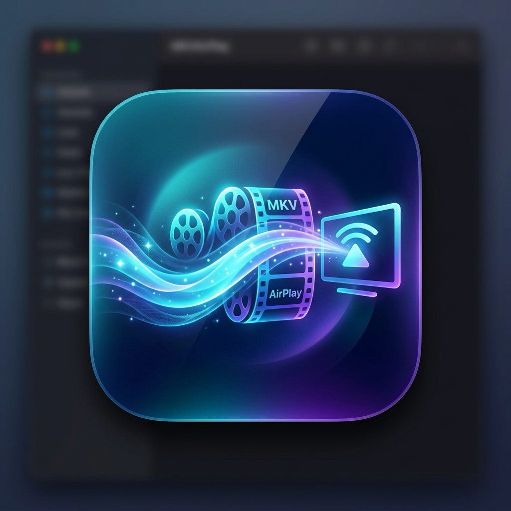
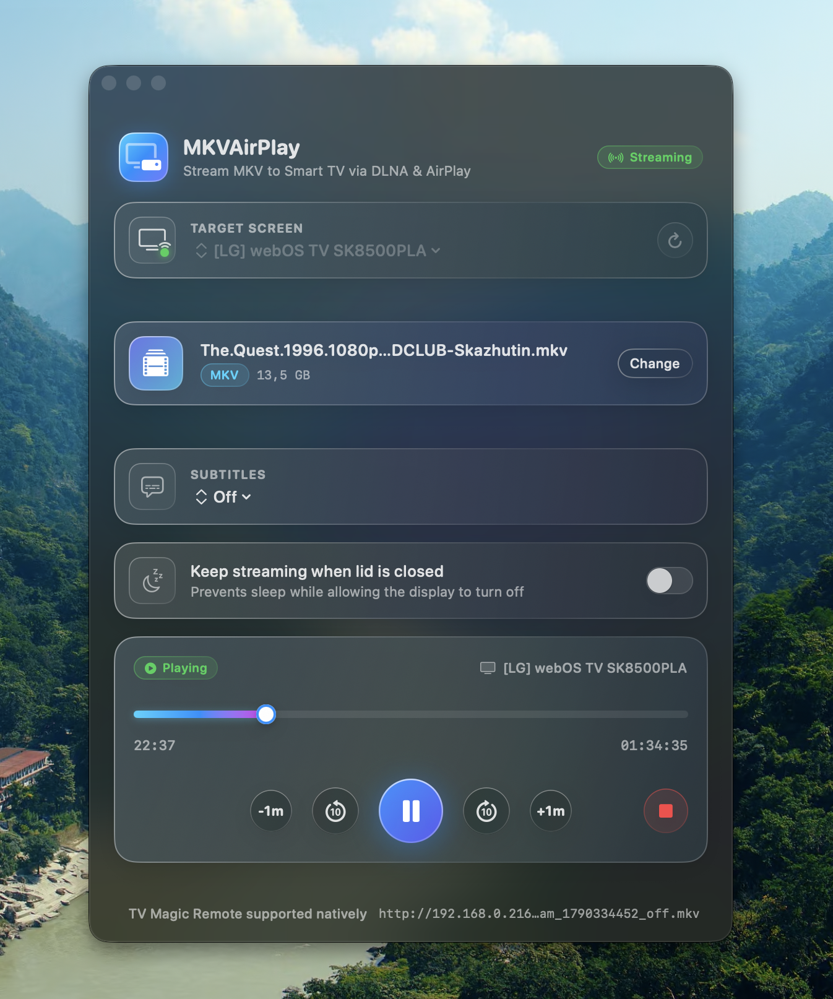

# MKVAirPlay 🎬 📡

A lightweight, high-performance native macOS application to stream **MKV** and other video files directly to your Smart TV (DLNA / UPnP AV) with real-time playback controls.

<p align="center">
  
</p>

<p align="center">
  
</p>

---

## ⚡ Why MKVAirPlay?

Standard Apple AirPlay video streaming requires video files to be in Apple-approved containers (MP4/HLS) and codecs, meaning MKVs normally require CPU-heavy re-encoding or full desktop screen mirroring.

**MKVAirPlay** uses **DLNA / UPnP AV (MediaRenderer)** protocol directly:
- **Direct Play without Transcoding**: Smart TVs (like LG webOS, Samsung Tizen, Sony Google TV) have powerful native hardware decoders capable of playing 4K HDR MKV files directly over the local network with 0% CPU load on your Mac.
- **Embedded Local Streaming Server**: Runs an in-memory, high-throughput HTTP byte-range server (`206 Partial Content`) optimized for instant seeking and seamless streaming.
- **Bi-Directional Playback Controls**: Control playback directly from your Mac (Play, Pause, Stop, Seek/Scrub, Skip) or use your **TV's Magic Remote**—both stay in sync!
- **Pure Native Swift**: 100% written in Swift and SwiftUI. Zero npm dependencies, zero Python runtime, zero Electron bloat. The final executable is under **1 MB**.

---

## ✨ Features

- 🎯 **Drag & Drop Simplicity**: Drop any `.mkv`, `.mp4`, `.mov`, `.avi`, `.webm`, or `.m4v` file onto the window.
- 📺 **Zero-Config Auto-Discovery**: Automatically discovers your Smart TV on the local Wi-Fi/Ethernet network via SSDP multicast.
- 💬 **Subtitle Settings & Switching**: Auto-detects embedded MKV subtitle tracks and external companion `.srt`/`.vtt` files. Turn subtitles off or switch languages on the fly!
- ☕ **Clamshell Streaming (Auto Battery Protection)**: Toggle to stream with your MacBook lid closed to turn off the display while audio & video continue uninterrupted. To protect your battery, sleep prevention only runs while a video is actively playing and automatically disables as soon as playback finishes or the TV stops!
- 🕹️ **Interactive Timeline Scrubber**: Seek to any timestamp (`HH:MM:SS`) with live progress and duration indicators.
- 🔊 **TV Volume & Mute Control**: Adjust hardware TV volume directly from your Mac with an interactive slider, precise `+` and `-` single-point step buttons, and keyboard shortcuts (`⌥⌘↑`, `⌥⌘↓`, `⌥⌘M`).
- ⏩ **Symmetric Transport Controls**: Perfectly balanced control deck with Volume on the left, Play/Pause and quick skips (-1m, -10s, +10s, +1m) centered, and Stop on the right.
- 📡 **Network Diagnostics**: Shows streaming endpoints, active bitrate/range requests, and device endpoints.
- 🌐 **Manual IP Support**: Connect directly to your TV's IP address if network isolation or complex subnets block multicast discovery.
- 🎨 **macOS Design**: Designed for macOS with dark/light mode support, vibrant accents, and smooth animations.

---

## 🚀 Quick Start

### Build & Run

Clone the repository and build the native `.app` bundle:

```bash
git clone https://github.com/volodymyr/mkvairplay.git
cd mkvairplay

# Build and package into MKVAirPlay.app
make app

# Launch the app
make run
```

Or run directly in debug mode:

```bash
swift run
```

---

## 🏗️ Architecture

```
MKVAirPlay/
├── Sources/MKVAirPlay/
│   ├── App/
│   │   └── MKVAirPlayApp.swift            # SwiftUI App entry point & NSApplicationDelegate
│   ├── Models/
│   │   ├── DLNADevice.swift               # UPnP device model (Friendly name, control URLs)
│   │   └── PlaybackState.swift            # Transport states & time conversion helpers
│   ├── Services/
│   │   ├── NetworkHelper.swift            # Local IP detection & MIME mapping
│   │   ├── LocalStreamingServer.swift     # High-speed HTTP byte-range streaming server
│   │   ├── SSDPDiscovery.swift            # UDP multicast discovery & XML parser
│   │   └── DLNAController.swift           # UPnP AVTransport SOAP controller (Play/Pause/Seek)
│   ├── ViewModels/
│   │   └── PlaybackViewModel.swift        # State coordination & 1-second position polling
│   └── Views/
│       ├── ContentView.swift              # Main macOS UI layout
│       ├── DevicePickerView.swift         # TV dropdown & manual IP configuration
│       ├── DropZoneView.swift             # Drag & drop target with file picker
│       └── PlaybackControlsView.swift     # Scrubber timeline & transport buttons
├── Resources/
│   ├── AppIcon.png                        # App Icon (1024x1024)
│   ├── AppIcon.icns                       # macOS Icon Bundle
│   ├── Info.plist                         # App metadata & local network permissions
│   └── Screenshot.png                     # Application screenshot
└── scripts/
    └── package_app.sh                     # Automated .app bundler and ad-hoc code signer
```

---

## 🛠️ Protocols Supported

| Service | Protocol | Functionality |
| :--- | :--- | :--- |
| **Discovery** | SSDP (`239.255.255.250:1900`) | Detects `MediaRenderer:1` devices |
| **Media Transport** | HTTP Range Requests (`206`) | Feeds MKV data with zero-copy chunked streaming |
| **Transport Control** | UPnP SOAP `AVTransport:1` | `SetAVTransportURI`, `Play`, `Pause`, `Stop`, `Seek`, `GetPositionInfo` |

---

## 📋 Requirements

- macOS 13.0 (Ventura) or newer (macOS Sonoma / Sequoia fully supported).
- Swift 5.9+ / Xcode Command Line Tools.
- Mac and Smart TV connected to the same local Wi-Fi or wired network.

---

## 📄 License

MIT License. Free to use, modify, and distribute.
